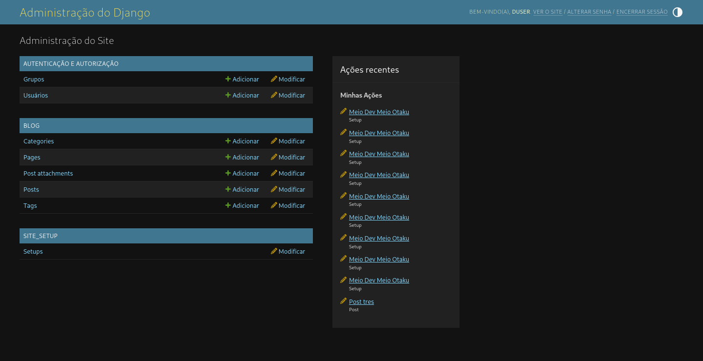
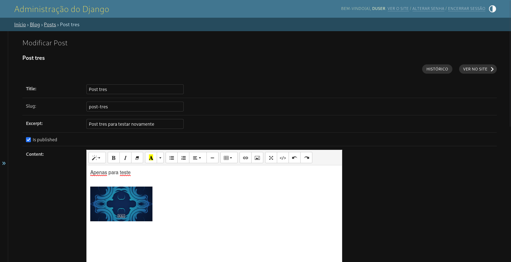
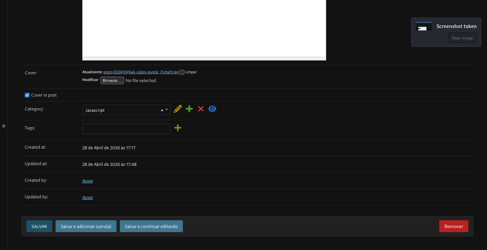
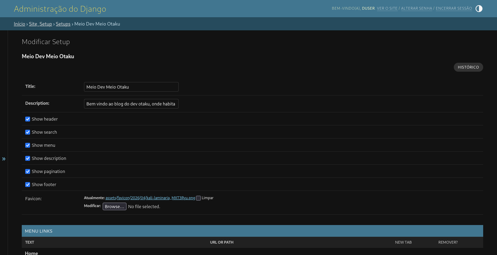
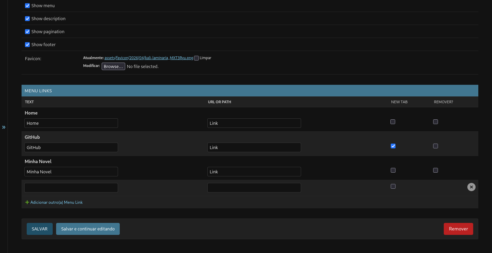

# Projeto Blog para Portfólio

<p align="center">
  
  
  
  
</p>

<p align="center">
  
  
</p>

---

## 📚 Índice

- [Visão Geral](#-visão-geral)
- [Estrutura do Projeto](#-estrutura-do-projeto)
- [Funcionalidades](#-funcionalidades)
- [Tecnologias Utilizadas](#-tecnologias-utilizadas)
- [Instalação e Execução com Docker](#-instalação-e-execução-com-docker)
- [Objetivo do Projeto](#-objetivo-do-projeto)
- [Créditos](#-créditos)
- [Licença](#-licença)

---

## 📌 Visão Geral

Este é um projeto web desenvolvido com o framework **Django**, utilizando **Python** como linguagem principal e executado em containers **Docker**.

O objetivo foi criar um **blog dinâmico e configurável**, no qual o autor pode gerenciar conteúdos, links externos e seções do site diretamente pelo painel administrativo.

O sistema permite:

- Publicar posts com editor avançado;
- Adicionar e gerenciar links externos;
- Configurar diferentes seções do site, como header e footer;
- Permitir que outras pessoas também publiquem no blog;
- Administrar conteúdos de forma prática pelo painel do Django.

---

## ⚙️ Estrutura do Projeto

O sistema é organizado dentro da pasta `djangoapp`, que contém:

```text
djangoapp/
├── project/       # Núcleo do Django: settings, urls, wsgi
├── blog/          # App responsável pela criação e exibição dos posts
└── site_setup/    # App para configuração das seções do site: header, footer e links
└── utils/         # Pasta com arquivos utils para o projeto.
```

## Arquivos .sh para automatizar comandos.

```text
collectstatic.sh    
commands.sh         
createsuperuser.sh
makemigrations.sh
migrate.sh
runserver.sh
``` 
### Arquivos principais

```text
Dockerfile          # Configuração da imagem Docker
docker-compose.yml  # Orquestração dos serviços
requirements.txt    # Dependências do projeto
```

---

## 🛠️ Funcionalidades

- **Administração de Posts:** editor Summernote integrado para criar e editar posts com formatação rica.
- **Gestão de Links:** menu dedicado para adicionar e remover links externos.
- **Configuração do Site:** opção de remover ou personalizar header e footer.
- **Publicação colaborativa:** possibilidade de outras pessoas também publicarem no blog.

---

## 📸 Capturas de Tela

### Seção Admin



### Seção Post no Admin





### Site Setup





---

## 🚀 Tecnologias Utilizadas

### Backend
- Python 3
- Django
- Django REST (se estiver usando)

### Banco de Dados
- PostgreSQL

### Frontend
- HTML5
- CSS3

### DevOps
- Docker
- Docker Compose

### Ferramentas
- Summernote Editor

---

## 🐳 Instalação e Execução com Docker

### Pré-requisitos

Antes de iniciar, certifique-se de ter instalado:

- Docker
- Docker Compose
- Postgresql

---

## Passo a passo

### 1. Clonar o repositório

```bash
git clone https://github.com/Fa1kerXd/projeto-blog-django.git
cd projeto-blog-django
```

---

### 2. Construir a imagem Docker

```bash
docker-compose up --build
```

---

### 3. Rodar os containers

```bash
docker-compose up
```

---

### 4. Aplicar migrações do banco de dados

> Observação: o arquivo `makemigrations.sh` está acoplado ao próprio arquivo `migrate.sh`.

```bash
docker-compose run --rm djangoapp migrate.sh
```

---

### 5. Criar superusuário para acessar o admin

```bash
docker-compose run --rm djangoapp createsuperuser.sh
```

---

### 6. Acessar no navegador

```text
Admin: http://localhost:8000/admin
Blog:  http://localhost:8000/
```

---

## 🎯 Objetivo do Projeto

Este projeto foi desenvolvido para compor meu portfólio, demonstrando habilidades em:

- Desenvolvimento web com Django;
- Estruturação de aplicações modulares;
- Integração de editor rico no painel administrativo;
- Customização de seções dinâmicas de um site;
- Utilização de containers Docker para ambiente de desenvolvimento;
- Organização de projeto para apresentação profissional no GitHub.

---

## 👤 Créditos

Desenvolvido por **Augusto Cesar da Silva**.

- GitHub: [Fa1kerXd](https://github.com/Fa1kerXd)
- Projeto: [projeto-blog-django](https://github.com/Fa1kerXd/projeto-blog-django)

---

## 📜 Licença

Este projeto está sob a licença **MIT**.

Isso significa que você pode:

- Usar o projeto;
- Modificar o código;
- Distribuir cópias;
- Utilizar como base para estudos ou melhorias.

Consulte o arquivo `LICENSE` para mais detalhes.

---

## ⭐ Considerações Finais

Este projeto foi criado com foco em aprendizado, prática profissional e demonstração de habilidades em desenvolvimento backend com Django.

Caso este projeto tenha sido útil, considere deixar uma estrela no repositório.
